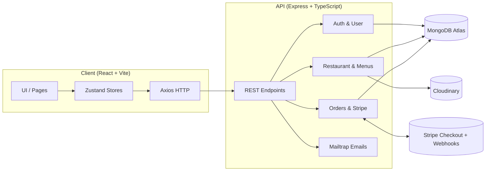

🍔 MernEats · Enterprise‑Grade MERN + TypeScript Food Ordering Platform

Badges


Executive Summary

MernEats is a full‑stack restaurant ordering platform that streamlines discovery, menu management, cart, and payments. Built with the MERN stack and TypeScript, it delivers a fast customer experience, a pragmatic admin workflow, and secure payments via Stripe Checkout with webhook order confirmation.

High‑Level Architecture



Core Modules & Capabilities
Core Modules & Capabilities

1. Customer Experience

- Smart Search: Fuzzy search across restaurant name, city, country, cuisines, and menu items.
- Cart & Checkout: Persistent cart (Zustand) and Stripe Checkout session with webhooks.
- Order History: Orders list page with per‑order detail view (item subtotals and totals).

2. Admin Experience

- Restaurant Profile: Create/update restaurant and banner image (Cloudinary).
- Menu Management: Add/Edit/Delete menus; Cloudinary image deletion on remove.
- Order Control: Update order status (pending → confirmed → preparing → outfordelivery → delivered).

3. Communication & Security

- Email Flows: Email verification and password reset via Mailtrap.
- Auth: Token‑based auth guard for protected routes and admin routes.

Technology Stack

| Layer    | Technology                                 | Purpose                                                    |
| -------- | ------------------------------------------ | ---------------------------------------------------------- |
| Frontend | React + Vite, TypeScript, Tailwind, Shadcn | Fast UI, component primitives, DX                          |
| State    | Zustand                                    | Lightweight global state (auth, cart, orders, restaurants) |
| Backend  | Node.js, Express (TypeScript)              | REST API, domain logic                                     |
| DB       | MongoDB + Mongoose                         | Persistent storage                                         |
| Payments | Stripe Checkout + Webhooks                 | Secure card payments                                       |
| Media    | Cloudinary                                 | Image upload/serve and deletion                            |
| Email    | Mailtrap                                   | Dev‑friendly transactional emails                          |

Project Structure

```
Restaurant-Website/
├─ client/                 # React + Vite (TypeScript)
│  ├─ src/
│  │  ├─ components/      # UI components (shadcn + custom)
│  │  ├─ pages/           # Views (Home, Search, Cart, Orders, etc.)
│  │  ├─ store/           # Zustand stores (user, cart, restaurant, orders)
│  │  ├─ schema/          # Zod schemas
│  │  └─ types/           # Shared TS types
│  └─ index.html          # App shell
├─ server/                 # Express API (TypeScript)
│  ├─ src/
│  │  ├─ controller/      # Controllers (user, restaurant, menu, order)
│  │  ├─ models/          # Mongoose schemas
│  │  ├─ routes/          # Express routers
│  │  ├─ utils/           # Helpers (cloudinary, token, upload)
│  │  └─ mailtrap/        # Email templates & client
└─ vercel.json            # Client deploy config (Vercel static build)
```

Experience Highlights

- Performance‑first UI (React + Vite) with minimal bundle and instant navigation.
- Robust search that understands restaurant names, cuisines, and even dish titles.
- Seamless checkout with clear order summaries and post‑payment status.
- Thoughtful admin flows for image management and status updates.

Screens Overview

- Home & Search: Hero search + advanced results with cuisine chips.
- Restaurant Profile: Banner, delivery time, and available menus.
- Cart & Checkout: Quantity controls, accurate totals, Stripe redirect.
- Orders: List view and per‑order detail with item‑wise subtotals and grand total.

Feature Summary

- Media: Cloudinary for optimized image delivery and clean deletion lifecycle.
- Payments: Stripe Checkout + webhook confirmation persisted to orders.
- State: Lightweight, predictable state with Zustand (user, cart, restaurant, orders).
- Types: End‑to‑end TypeScript for maintainability and fewer runtime errors.

Notes & Security

- Never commit secrets. Keep server/.env local or use Vercel/hosted env vars.
- Stripe requires integer amounts (cents). We use Math.round for safety.
- Webhook must use the exact whsec\_… printed by stripe listen.
- Cloudinary deletes menu images when menus are removed.

Troubleshooting

- Stripe 500 on session create:
  - Check STRIPE_SECRET_KEY and allowed shipping countries.
  - Ensure unit_amount is integer (cents).
- Webhook not firing:
  - Ensure stripe listen is running and WEBHOOK_ENDPOINT_SECRET matches.
- Mail not delivered:
  - Mailtrap demo inbox only receives to test recipients.

License

All rights reserved. For internal/project use.
